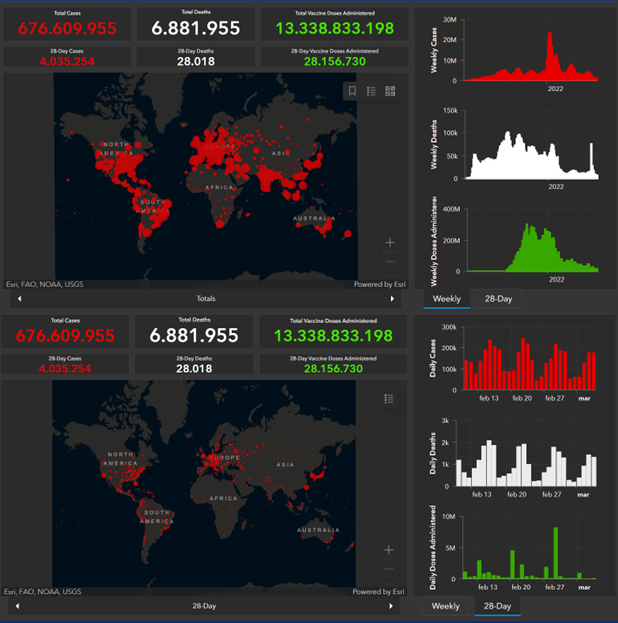
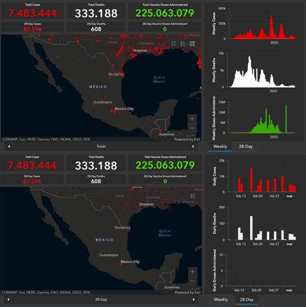

```{r setup, include=FALSE}
knitr::opts_chunk$set(echo = TRUE)
```
# PARTE 1
## *1. ¿Cuál es la situación actual de COVID-19 a nivel mundial, en México?*

### SITUACIÓN GLOBAL DEL COVID-19
[1] En 2019 llego la famosa pandemia que nos provocó estar por un largo tiempo en cuarentena encerrados en nuestras casas sin poder convivir con gente de manera presencial, hoy día eso ya solo es como un mal recuerdo que contamos. A pesar de que ya pasaron más de dos años de esto y hoy podemos estar en cualquier parte que queramos respirando sin la necesidad de un cubrebocas o una distancia mínima de 1.5 metros este virus no ha desaparecido porque vino para quedarse.

{width=60%}

A pesar de que ya no tenemos las restricciones que antes teníamos y la mayoría de nosotros contamos con 2 vacunas y 1 refuerzo, el COVID-19 convive con nosotros. En el mapa superior de la Figure 1, podemos ver la diferencia de los casos detectados, muertos y vacunas aplicadas totales alrededor del mundo. En el mapa inferior de la Figure 1 vemos los mismos datos registrados pero en los últimos 28 días donde fueron detectados alrededor de 4 millones de casos de contagio y 28 mil muertes a pesar de que en estos años de la pandemia se aplicaron más de 13 mil millones de vacunas y se siguen aplicando vacunas en algunos lugares del mundo. Esto nos muestra que a pesar de que se desarrollaron varias vacunas para contrarrestar el COVID-19 o que este no nos ataca tan agresivamente como lo hacía al principio de la pandemia, el virus evoluciona y muta tan rápido que en algunos casos sigue siendo mortal para la gente.

## SITUACION EN MEXICO DEL COVID-19
[1.1] En México la situación es bastante similar, en el mapa superior de la Figure 2 vemos que los datos acumulados lograron llegar a los 7 millones de casos detectados, más de 300 mil muertes registradas y alrededor de 225 millones de vacunas aplicadas. En el mapa inferior de la Figure 2, podemos observar cómo seguimos contando con contagios de 82,596 en los últimos 28 días, así como 608 muertes. A diferencia de las cifras globales podemos identificar como en los últimos meses no se ha aplicado ni una sola vacuna en México. Actualmente solo el 64.60% de la población mexicana está completamente vacunada, lo que es un foco de alerta debido a que aunque ya convivimos con el virus y ya no es tan letal como lo era al principio de la pandemia, sigue existiendo este sector que no tiene todas las vacunas provocando un riesgo de propagación del virus si es que ellos se contagian. Es por eso que es muy importante seguir teniendo las medidas de higiene y prevención que se tuvieron durante la pandemia para minimizar los contagios lo más posible tomando en cuenta que el virus todo el tiempo está mutando y se esta adaptando al ambiente donde se mueve.

{width=60%}

&nbsp;

## *2. ¿Cuál fue la primera variante del virus que se propagó a todo el mundo?*
[2] La primera variante que se propago fuera de China fue la variante original, llamada SARS-CoV-2, esta fue detectada por primera vez el 31 de diciembre del 2019 por el médico Li Wenliang en Wuhan, China. Esto dio inicio a la pandemia del COVID-19, a la cuarentena global y causando alrededor de casi 7 millones de muertes alrededor del mundo por este virus y sus diferentes variantes en las distintas regiones.

&nbsp;

## *3. ¿Cuáles son las otras variantes del virus que existen en otras regiones del mundo?*
[3] A lo largo de estos años que la pandemia llego, se han identificado múltiples variantes del COVID-19. Sin embargo, no todas son de interés, es decir, solo algunas de estas variantes representaron una amenaza de salud para las personas y estas son las que han provocado los contagios masivos y las muertes a lo largo del mundo, las más nombradas son:

### [4] VARIANTES DE INTERES

**•	SARS-CoV-2 (diciembre de 2019, Wuhan, China)** Primer variante identificada en la ciudad de Wuhan en China, provocando el inicio de la pandemia. Esta variante la conocemos como la variante original, SARS-CoV-2.

**•	Alpha B.1.1.7 (septiembre de 2020, Reino Unido)** Esta variante, después del SARS-CoV-2, fue de las primeras en llegar a México a través de personas que venían desde Italia espaerciendo el virus a todo el mundo.

**•	Delta B.1.617.2 (octubre de 2020, India)** Esta variante era mucho más transmisible que la original.

**•	Ómicron B.1.1.529 (noviembre de 2021, Sudáfrica)** Junto con las vacunas y los refuerzos esta variante fue la que logro que pudiéramos empezar a convivir con el virus, debido a que esta hacia que se presentaran síntomas desde el 3er día y los síntomas fueron menos agresivos que las anteriores.

**•	[5] Arcturus XBB.1.5 (enero 2023, India)** Subvariante del Ómicron. Es la variante más actual encontrada en el 2023 y según la OMS, es más contagiosa que las anteriores y más resistente a la inmunidad.

&nbsp;

## *4. ¿Cómo buscarías información de la variante del virus en tu país?*
[6] Gracias a los avances tecnológicos con los que contamos hoy en día, la manera más facil para buscar información de las variantes de este virus en México seria a través del internet. Algunos de los sitios o lugares confiables para poder encontrar información verídica serian:

### SITIOS WEB

•	Secretaria de Salud de México

•	Instituto Nacional de referencia Epidemiológica (InDRE)

•	Instituto Nacional de Enfermedades Respiratorias (INER)

### MEDIOS DE COMUNICACIÓN

•	El Universal

•	La Jornada

•	Reforma

•	Milenio

•	Excélsior

### ORGANIZACIONES MUNDIALES

•	Organización Mundial de la Salud (OMS)

•	Centro para el Control y la Prevención de Enfermedades (CDC)

•	Fundación para el Control y la Prevención de Enfermedades (CEPI)

En importante consultar cualquier información en al menos dos fuentes de información diferente para entender el panorama completo de lo que estas buscando, así como asegurarnos de estar recopilando la información de sitios confiables o certificados para que no nos veamos afectados por opiniones de quien lo escribe y podamos encontrar información objetiva de nuestro interés.

&nbsp;

## *5. Imagina que te encuentras en una situación similar a la de Li Wenliang, médico chino que intentó alertar sobre el brote de coronavirus en su país, pero fue detenido por las autoridades y obligado a retractarse, ¿qué harías en su caso?*

Si yo hubiera estado en la posición del médico Li Wenliang hubiera esparcido la información por la prensa y por medio de redes sociales que estuviera en mis manos, debido a que es una información tanto delicada como importante como para esconderla. Como sabemos China vive en un gobierno totalitarista, razon por la que lo que le paso al médico por compartir en un chat privado esa información fue que la policía lo detuvo hasta que él y su familia presentaron síntomas del virus. Pienso que lo mejor en esta situación, teniendo la idea de que ese virus encontrado es muy peligroso y afecto a todo el mundo, crearía intriga y la curiosidad necesaria en las redes sociales para que el gobernó y las instituciones pertinentes investiguen y hagan acciones respecto a como evitar la propagación del virus recién encontrado. A lo mejor me perjudicaría personalmente y el gobierno me retendría por divulgar esa información, pero por lo menos lograría que la gente se enterara del brote y que exigiera al gobierno a investigar y prevenir lo peor de la propagación del virus.

## *REFERENCIAS*

* COVID-19 Map - Johns Hopkins Coronavirus Resource Center. (s. f.). Johns Hopkins Coronavirus Resource Center. https://coronavirus.jhu.edu/map.html

* **[1]** Gobierno de México. (2021, septiembre). Variantes COVID-19. Recuperado 22 de abril de 2023, de https://coronavirus.gob.mx/variantes-covid-19/

* **[1.1]** México - COVID-19 - Vacunas administradas 2023. (s. f.). Datosmacro.com. https://datosmacro.expansion.com/otros/coronavirus-vacuna/mexico 

* **[2]** CNN Salud+. (2020). Cronología del coronavirus: así comenzó y se extendió el virus que tiene en alerta al mundo. CNN. https://cnnespanol.cnn.com/2020/02/20/cronologia-del-coronavirus-asi-comenzo-y-se-extendio-el-virus-que-pone-en-alerta-al-mundo/ 

* **[3]** NCBI Virus. (s. f.). https://www.ncbi.nlm.nih.gov/labs/virus/vssi/#/virus?SeqType_s=Nucleotide&VirusLineage_ss=Severe%20acute%20respiratory%20syndrome%20coronavirus%202,%20taxid:2697049 

* **[4]** Enfermedad del coronavirus 2019 (COVID-19). (2020, 11 febrero). Centers for Disease Control and Prevention. https://espanol.cdc.gov/coronavirus/2019-ncov/variants/variant-classifications.html

* **[5]** Redacción. (2023, 6 abril). Nueva variante ómicron XBB.1.16 es más infecciosa, advierte OMS. El Financiero. https://www.elfinanciero.com.mx/salud/2023/04/06/nueva-variante-omicron-xbb116-es-mas-infecciosa-advierte-oms/#:~:text=La%20variante%20XBB.,de%20casos%20en%20la%20India.&text=A%20tres%20a%C3%B1os%20de%20la,autoridades%20sanitarias%20a%20nivel%20mundial.

* **[5.1]** What to know about XBB.1.16, the «Arcturus» variant. (2023, 26 abril). NBC News. https://www.nbcnews.com/health/health-news/covid-variant-arcturus-spreading-know-xbb116-rcna81572

* **[5.2]** Bello, C. (2023, 26 abril). Arcturus: lo que hay que saber sobre esta variante de COVID 19 que hay que vigilar según la OMS. euronews. https://es.euronews.com/next/2023/04/26/arcturus-lo-que-hay-que-saber-sobre-esta-variante-de-covid-19-que-hay-que-vigilar-segun-la

* **[6]** De Salud, S. (s. f.). VARIANTES DEL VIRUS SARS-CoV2. gob.mx. https://www.gob.mx/salud/es/articulos/variantes-del-virus-sars-cov2?idiom=es

* **[6.1]** Universidad Veracruzana (s. f.). Otras fuentes de información de interés sobre el COVID-19 – Coordinación Universitaria de Observatorios (CUO). https://www.uv.mx/cuo/observat-covid-19/otras-fuentes-de-informacion-de-interes-sobre-el-covd-19/


# PARTE 2
+ ***Función para saber la longitud de una secuencia***
```{r}
tamSeq <- function(dnaseq) {
  contador <- 0
  for (i in 1:length(dnaseq)) {
    contador <- contador + 1
  }
  print(paste0("Tamaño de la secuencia = ", contador))
}
```
&nbsp;

* ***Función para sacar todos los nucleotidos de la secuencia de cada variante***
```{r}
countNucleotidos <- function(dnaseq){
  bases <- c("C", "G", "A", "T")
  amount =c(0, 0, 0, 0)
  for(i in 1:length(bases)){
    contador <- 0
    for(j in 1:length(dnaseq)){
      if (bases [i] == dnaseq [j]){
        contador <- contador + 1
      }
    amount[i] <- contador*100/length(dnaseq)
    }
  }
  # Imprime en % de Nucleotidos de la secuencia que esta siendo evaluada en la función
  cat("% de Nucleotidos\n", amount[1],"%C", amount[2], "%G", amount[3], "%A",
      amount[4], "%T")
  return(amount)
}
```
&nbsp;

* ***Función para contar el %GC que hay en cada secuencia***
```{r}
contadorGC <- function(dnaseq) {
  bases <- c("C", "G")
  c <- 0
  for(i in 1:length(bases)){
    contador <- 0
    for(j in 1:length(dnaseq)){
      if (bases [i] == dnaseq [j]){
        contador <- contador + 1
      }
    }
    amount <- contador*100/length(dnaseq)
    c <- amount + c    
  }
  print(paste0("%GC en la secuencia : ", c, "%"))
}
```
&nbsp;

* ***Función para sacar la secuencia contrasentido***
```{r}
reverse <- function(dnaseq) {
  hebraInversa <- rev(dnaseq)
  return(hebraInversa)
}
```

# 1. Obtén las secuencias de las variantes de SARS-CoV-2
*Lectura de archivos FASTA y guardarlo dentro del codigo para no tener que buscar dentro del archuivo cada vez que necesite las secuencias*
```{r}
#Librerias necesarias para poder leer archivos por medio de "seqinr"
library(seqinr)
library(ape)
#WUHAN <- Primer variante detectada
Wuhan <- seqinr::read.fasta(file=paste0(getwd(),.Platform$file.sep,
                                        .Platform$file.sep,"Wuhan.fasta"), seqtype = "AA")
#ALPHA <- Encontrada en Reino Unido
Alpha <- seqinr::read.fasta(file=paste0(getwd(),.Platform$file.sep,
                                        .Platform$file.sep,"Alpha.fasta"), seqtype = "AA")
#DELTA <- Encontrada en India
Delta <- seqinr::read.fasta(file=paste0(getwd(),.Platform$file.sep,
                                        .Platform$file.sep,"Delta.fasta"), seqtype = "AA")
#OMICRON <- Encontrada en Sudáfrica
Omicron <- seqinr::read.fasta(file=paste0(getwd(),.Platform$file.sep,
                                      .Platform$file.sep,"Omicron.fasta"), seqtype = "AA")
#ACTUAL <- Variante más reciente en México
Actual <- seqinr::read.fasta(file=paste0(getwd(),.Platform$file.sep,
                                      .Platform$file.sep,"Actual.fasta"), seqtype = "AA")
```
&nbsp;

* ***Sacar la cantidad de nucleotidos de cada secuencia para comparar su estructura molecular***
```{r}
#WUHAN
Wuhan_arr <- countNucleotidos(unlist(seqinr::getSequence(Wuhan)))
#ALPHA
Alpha_arr <- countNucleotidos(unlist(seqinr::getSequence(Alpha)))
#DELTA
Delta_arr <- countNucleotidos(unlist(seqinr::getSequence(Delta)))
#OMICRON
Omicron_arr <- countNucleotidos(unlist(seqinr::getSequence(Omicron)))
#OMICRON
Actual_arr <- countNucleotidos(unlist(seqinr::getSequence(Actual)))
```
&nbsp;

* ***Función para graficar las secuencias de las diferentes variantes***
```{r}
#Libreria necesaria para poder graficar con "ggplot"
library("ggplot2")
graficar <- function(Wuhan, Alpha, Delta, Omcron, Actual){
  #Variantes que vamos a comparar en la gráfica
  variantes <- c("Wuhan", "Alpha", "Delta", "Omicron", "Actual")
  #Porcentaje de nucleotidos que tienen las secuencias de cada variante
  conteo <- c(Wuhan_arr, Alpha_arr, Delta_arr, Omicron_arr, Actual_arr)
  #Nucleotidos que van a ser comparados en la gráfica
  Nucleotidos <- c("C", "G", "A", "T")
  #Datos que van a ser proyectados en la gráfica
  df <- data.frame(variantes, conteo, Nucleotidos)
  
  #Función "ggplot" para graficar (Asignación de los valores en cada eje de la gráfica) +
  #(creación de una gráfica de barras) + (Nombres de los ejes "x" y "y") + (Nombre de
  #la gráfica) + (Posición del título) + (Color de los nucleotidos dentro de la gráfica)
  ggplot(df, aes(x = variantes, y = conteo, fill = Nucleotidos)) +
    geom_bar(stat = "identity", position = "dodge") + xlab("Secuencia") +
    ylab("Nucleotidos (%)") + ggtitle("Composición de nucleótidos de 5 variantes") + 
    theme(plot.title = element_text(hjust = 0.5)) +
    scale_fill_manual(values = c("C"="orange", "G"="green", "A"="red", "T"="purple"))
}
```

# 2. Calcula la longitud de las secuencias de cada variante.
```{r}
#WUHAN
tamSeq(unlist(seqinr::getSequence(Wuhan)))
#ALPHA
tamSeq(unlist(seqinr::getSequence(Alpha)))
#DELTA
tamSeq(unlist(seqinr::getSequence(Delta)))
#OMICRON
tamSeq(unlist(seqinr::getSequence(Omicron)))
#ACTUAL
tamSeq(unlist(seqinr::getSequence(Actual)))
```

# 3. Crea una gráfica donde compares las bases de ADN que componen a cada una de las variantes del virus.
```{r}
graficar(Wuhan_arr, Alpha_arr, Delta_arr, Omcron_arr, Actual_arr)
```

# 3.1 Interpretación de la gráfica
En la gráfica podemos ver de manera más clara como es que las variantes estar relacionadas con la variante original (Wuhan).
Podemos ver tanto en la grafica como en la función que saca la cantidad de nucleotidos que los porcentajes de los nucleotidos son demasiado similares, pero a pesar de eso la cantidad de nucleotidos que tienen diferentes son muchismos aunque no podamos identificar eso en la gráfica ni en los porcentajes.
Un ejemplo es el % de la Timina:

* Wuhan = 32.08374 %T
* Alpha = 32.13649 %T
* Delta = 32.13903 %T
* Omicron = 31.66459 %T
* Actual = 32.20007 %T

Como mencioné, a simple vista en los porcentajes no se aprecia la gran diferencia que poseen las variantes. Ahora hagamos el calculo de cuantos nucleotidos diferentes tienen las primeras 2 variantes solo para ver que tan diferentes son una de la otra solo comparando la diferencia de porcentaje de la Timina:

* 32.13649 - 32.08374 = 0.05275 %T

La variante Wuhan tiene una diferencia del 0.05275% menos de Timina que la variante Alpha. Ahora cuantos nucleotidos en la secuencia de la variante Alpha equivale ese porcentaje:

* (0.05275 x 29717)/100 = 15.6757175 nucleotidos de Timina en la variante Alpha

Ahora con este cálculo podemos ver de manera mas clara como ese pequeño porcentaje de diferencia de nucleotidos de Timina que no alcanza a llegar ni al 0.01% causa una gran diferencia en la cantidad de nucleotidos entre las variantes. Esto podemos pensar que no tiene un cambio significativo en la secuencia pero todo lo contrario, si en una secuenci cambia aunque sea un solo nucleotido esto cambia la estructura del virus o variante que podria llegar a ser la diferencia en que si te contagias puedas recurperarte o sea una enfermedad incurable o muy agresiva al contacto con el cuerpo humano.

Por eso estas pequenas diferencias, que en algunas de las barras no logramos apreciar debido al pequeño porcentaje de diferencia que se tiene, son muy importantes en la biología.

# 4. ¿Cuál es el %GC de cada variante?
```{r}
#WUHAN
contadorGC(unlist(seqinr::getSequence(Wuhan)))
#ALPHA
contadorGC(unlist(seqinr::getSequence(Alpha)))
#DELTA
contadorGC(unlist(seqinr::getSequence(Delta)))
#OMICRON
contadorGC(unlist(seqinr::getSequence(Omicron)))
#ACTUAL
contadorGC(unlist(seqinr::getSequence(Actual)))
```

# 5. Crea las secuencias contrasentido de cada variante.
```{r}
#WUHAN
reverse(unlist(seqinr::getSequence(Wuhan)))
#ALPHA
reverse(unlist(seqinr::getSequence(Alpha)))
#DELTA
reverse(unlist(seqinr::getSequence(Delta)))
#OMICRON
reverse(unlist(seqinr::getSequence(Omicron)))
#ACTUAL
reverse(unlist(seqinr::getSequence(Actual)))
```

